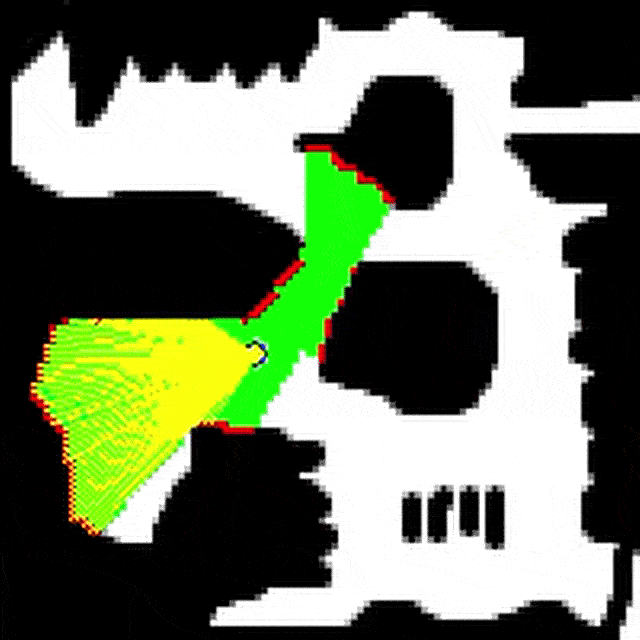

# Robot Exploration 

A tiny two-wheel robot with a 100-ray lidar learns objecthood from pure sensorimotor experience. With no labels or tasks, it samples simple actions and tracks how they distort the lidar stream, revealing stable “things” in the world—structures it can use to predict, navigate, and act coherently.

A lightweight Gym-style setup for 2D robot navigation and exploration using lidar.



Figure interpretation. Black - obstacles. White - free space. Green - explored regions. Yellow - lidar rays. Maroon - detected obstacles. 

Overall, the project explores how autonomous agents can bootstrap internal representations from sensorimotor experience, aiming toward the goal of developing self-sustaining computational systems.

## Environments

Maps are stored as bitmap images in `environments/`.

* **White** = free space
* **Black** = obstacles

## Data Collection

The agent is a differential-drive robot (two wheels) with **100 lidar rays**.

Ensure that requirements are installed 

```bash
!pip install -r requirements.txt
``` 

You can run exploration with predefined strategies. Example: random walk.

```bash
python main.py --strategy random --max_steps 10000 --env 6.png
```

Results are saved automatically to an `output/` folder with timestamped directories. Other strategies include manual control, uniformly distributed random run lengths, levy walks, etc. 

## Performance Comparison Analysis

After running experiments, compare strategies (including baseline-relative deltas) with:

```bash
python -m analysis.performance.run_performance_analysis --root output --baselines random,levy,uniform --success-threshold 25 --plots
```

Outputs are written to `analysis/performance/results/`:
- `per_generation_comparison.csv`
- `per_trial_summary.csv`
- `baseline_deltas.csv`
- `report.json`


## 🚀 Exploration Strategies

The system supports several strategies for robot movement and learning. You can select these using the `--strategy` flag.


| Strategy     | Description                                                                 |
|--------------|-----------------------------------------------------------------------------|
| `random`     | A basic **Random Walk** where the robot picks a new discrete action at every step. |
| `levy`       | A **Lévy Walk** strategy using a Pareto distribution for step lengths, mimicking natural foraging patterns. |
| `uniform`    | **Uniform Run Length** strategy where robots move in a direction for a random duration chosen from a uniform range. |
| `manual`     | **Manual Control** mode. Use arrow keys to drive a single robot yourself. |
| `spiking`    | **NN Spiking**: Uses a population of Leaky Integrate-and-Fire (LIF) neurons that accumulate activity over time. |
| `random_nn`  | **NN Random**: A feedforward neural network subjected to natural selection to evolve navigation behavior. |


> **Note on Manual Control**: This mode forces the population size to **1** and automatically enables rendering. Use **Arrow Keys** to move and **ESC/Q** to quit.


## 🛠️ Main Execution Options

Use `main.py` to launch experiments with specific environment configurations.

### Key Arguments
* **`--env [file.png]`**: Specifies the map image from `environments/images/`. White pixels represent free space; black pixels are obstacles.
* **`--no_lut`**: Disables the **Look-Up Table (LUT)**.
    * **Why use it?** Lidar ray marching is computationally expensive ($O(\text{envs} \times \text{rays} \times \text{length})$). A pre-generated LUT allows for $O(1)$ distance retrieval, significantly speeding up simulations with large populations.
* **`--population [N]`**: Sets the number of parallel robots running in the vectorized environment.
* **`--max_steps [N]`**: The maximum energy/time steps allowed per individual before they are marked as "done".
* **`--render`**: Display robot and environment on screen. 

**Example Command:**
```bash
python main.py --strategy random --env 6.png --population 10 --render
```

# Updated README: Robot Exploration

This project features a differential-drive robot with **100 lidar rays** designed to learn navigation from sensorimotor experience. It utilizes a vectorized 2D environment where agents are selected based solely on **survival**—their ability to reach a goal before depleting energy or health.

---

## 🚀 Exploration Strategies

The system supports several strategies for movement and neuroevolution, selectable via the `--strategy` flag.

| Strategy | Description |
| :--- | :--- |
| **`random`** | A basic **Random Walk** where robots pick a new discrete action at every step. |
| **`levy`** | A **Lévy Walk** using a Pareto distribution for step lengths, mimicking natural foraging patterns. |
| **`uniform`** | **Uniform Run Length** strategy where robots move in a direction for a random duration chosen from a uniform range. |
| **`manual`** | **Manual Control** mode. Use arrow keys (↑, ↓, ←, →) to drive a single robot. |
| **`spiking`** | **NN Spiking**: Uses a population of Leaky Integrate-and-Fire (LIF) neurons that accumulate activity to decide actions. |
| **`random_nn`** | **NN Random**: A feedforward neural network evolved through natural selection. |

> **Note on Manual Control**: This mode forces the population size to **1** and automatically enables rendering.

---

## 🛠️ Main Execution Options

Use `main.py` to launch experiments with specific environment configurations.

### Core Arguments
* **`--env [file.png]`**: Specifies the map image from `environments/images/`. 
    * **White** = free space.
    * **Black** = obstacles.
* **`--no_lut`**: Disables the **Look-Up Table (LUT)**.
    * **Why use it?** Standard ray marching is computationally heavy at $O(\text{num\_envs} \times \text{num\_rays} \times \text{ray\_length})$. A pre-generated LUT allows for **$O(1)$ distance retrieval**, significantly speeding up simulations.
* **`--render`**: Enables the visual display of the robots, lidar rays, and the environment using Pygame.
* **`--max_steps [N]`**: The maximum energy/time steps allowed per individual (default: 1000).

---

## 🧬 Evolutionary Structure

Experiments are organized into a hierarchy to track progress across populations:

* **Trial (`--trials`)**: An independent run of the experiment. A trial continues until the maximum number of generations is reached or the population goes **extinct** (no survivors).
* **Generation (`--generations`)**: A single evolutionary iteration. Successful individuals (those who reach the goal) are selected to reproduce for the next generation.
* **Population (`--population`)**: The group of individuals running in parallel within a single generation. All individuals in a population are evaluated simultaneously in the vectorized environment.


---

## 📊 Mass Experiments

For large-scale benchmarking, use `run_many.py` to automate sequential trials across all strategies

```bash
# Example: Run all strategies with a population of 1000 for 10 trials
python run_many.py --strategy all --trials 10 --population 1000
```
Results, including `metadata.json` and success trends, are saved in timestamped directories within the `output/` folder.

## 📊 Mass Experiments

For large-scale benchmarking across multiple strategies, use `run_many.py`. This script automates sequential trials for all five main strategies (Random, Lévy, Uniform, Random\_NN, and Spiking).

### Usage:
* **Run everything:** `python run_many.py --strategy all`.
* **Configuration:** You can override default parameters like `--trials`, `--generations`, and `--population` directly from the CLI.
* **Output:** Results are saved in a timestamped "mass-run" folder containing individual logs, metadata, and performance summaries for each strategy.